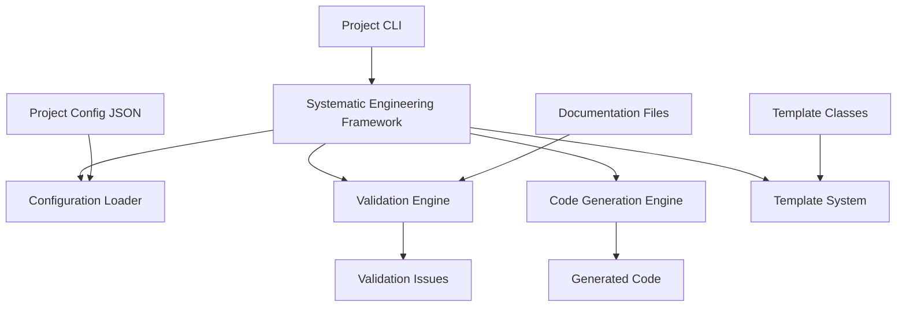

# Technical Implementation Guide

**Deep Dive into the Systematic Engineering Framework Architecture**

This document provides technical details for developers who want to understand, modify, or extend the framework.

---

## Framework Architecture

### Core Components Overview



### Class Hierarchy

```python
# Core Framework
class SystematicEngineeringFramework:
    def __init__(config_path: str)
    def validate_all() -> List[ValidationIssue]
    def generate_module(module_name: str) -> Optional[str]

# Template System  
class CodeTemplate(ABC):
    @abstractmethod
    def generate(config: Dict, specs: List[str]) -> str

class HalImplementationTemplate(CodeTemplate)
class ControlSystemTemplate(CodeTemplate)

# Data Structures
@dataclass
class TraceabilityID:
    tier: str
    category: str 
    number: int
    full_id: str

@dataclass 
class ValidationIssue:
    severity: str
    category: str
    message: str
    file_path: Optional[str]
    line_number: Optional[int]
```

## Configuration System

### JSON Schema Structure

```json
{
  "project_name": "string",
  "project_description": "string", 
  "traceability_schema": {
    "tiers": ["string"],
    "categories": ["string"],
    "id_format": "string with {tier}, {category}, {number} placeholders"
  },
  "code_generators": {
    "generator-name": {
      "template": "template_name",
      "traceability_ids": ["ID1", "ID2"],
      "target_struct": "StructName",
      "trait_impl": "optional::trait::path",
      "description": "string",
      "custom_fields": "any additional configuration"
    }
  },
  "templates": {
    "template_name": {
      "base": "base_template_name",
      "customizations": {
        "feature_flag": true,
        "custom_value": "string"
      }
    }
  },
  "validation_rules": {
    "required_derivation_fields": ["string"],
    "cross_reference_targets": ["filename.md"],
    "safety_critical_patterns": ["pattern"],
    "blocking_validation": ["validation_type"],
    "health_score_weights": {
      "issue_type": -10
    }
  }
}
```

### Configuration Loading

```python
def _load_config(self) -> Dict[str, Any]:
    """Load and validate project configuration"""
    try:
        with open(self.config_path, 'r') as f:
            config = json.load(f)
        
        # Validate required fields
        required_fields = ['project_name', 'traceability_schema']
        for field in required_fields:
            if field not in config:
                raise ValueError(f"Missing required field: {field}")
        
        return config
    except Exception as e:
        raise RuntimeError(f"Failed to load project config: {e}")
```

## Validation Engine

### Validation Types

**1. Traceability ID Validation**
```python
def _validate_traceability_ids(self):
    """Find and validate all traceability IDs"""
    schema = self.config.get("traceability_schema", {})
    found_ids = set()
    duplicate_ids = []
    
    for doc_file in self.docs_dir.glob("*.md"):
        content = doc_file.read_text(encoding='utf-8')
        
        # Pattern matches T1-CATEGORY-001, T2-CATEGORY-001, etc.
        pattern = r'T\d+-[A-Z]+-\d+'
        ids_in_file = re.findall(pattern, content)
        
        for id_str in ids_in_file:
            if id_str in found_ids:
                duplicate_ids.append(id_str)
            else:
                found_ids.add(id_str)
```

**2. Cross-Reference Validation**
```python
def _validate_cross_references(self):
    """Check that referenced files exist"""
    validation_rules = self.config.get("validation_rules", {})
    targets = validation_rules.get("cross_reference_targets", [])
    
    for target in targets:
        if not (self.docs_dir / target).exists():
            self.validation_issues.append(ValidationIssue(
                severity="warning",
                category="missing_file",
                message=f"Referenced file missing: {target}"
            ))
```

**3. Derivation Field Validation**
```python
def _validate_derivations(self):
    """Check that traceability blocks have required fields"""
    validation_rules = self.config.get("validation_rules", {})
    required_fields = validation_rules.get("required_derivation_fields", [])
    
    # Scan for traceability blocks and validate fields
    for doc_file in self.docs_dir.glob("*.md"):
        content = doc_file.read_text(encoding='utf-8')
        
        # Find traceability blocks: **🔗 T2-CONTROL-001**: **Title**
        traceability_blocks = re.findall(
            r'\*\*🔗 (T\d+-[A-Z]+-\d+)\*\*:.*?\n(.*?)(?=\n\*\*|$)',
            content, re.DOTALL
        )
        
        for trace_id, block_content in traceability_blocks:
            for field in required_fields:
                if field not in block_content:
                    self.validation_issues.append(ValidationIssue(
                        severity="warning",
                        category="missing_derivation",
                        message=f"{trace_id} missing field: {field}"
                    ))
```

### Health Score Calculation

```python
def calculate_health_score(self) -> int:
    """Calculate engineering health score from validation issues"""
    weights = self.config.get("validation_rules", {}).get("health_score_weights", {})
    base_score = 100
    
    for issue in self.validation_issues:
        weight = weights.get(issue.category, -1)
        base_score += weight  # weights are negative
    
    return max(0, min(100, base_score))
```

## Code Generation Engine

### Template Resolution

```python
def generate_module(self, module_name: str) -> Optional[str]:
    """Generate code module from specifications"""
    generators = self.config.get("code_generators", {})
    
    if module_name not in generators:
        return None
    
    generator_config = generators[module_name]
    template_name = generator_config.get("template", "hal_implementation")
    
    # Resolve template (may be custom or have base template)
    if template_name in self.templates:
        template = self.templates[template_name]
    else:
        # Check for template configuration with base
        template_config = self.config.get("templates", {}).get(template_name)
        if template_config:
            base_name = template_config.get("base", "hal_implementation")
            template = self.templates[base_name]
        else:
            return None
    
    # Extract specifications and generate
    specs = self._extract_specifications(
        generator_config.get("traceability_ids", [])
    )
    return template.generate(generator_config, specs)
```

### Specification Extraction

```python
def _extract_specifications(self, traceability_ids: List[str]) -> List[str]:
    """Extract specification text for given traceability IDs"""
    specs = []
    
    for doc_file in self.docs_dir.glob("*.md"):
        content = doc_file.read_text(encoding='utf-8')
        
        for trace_id in traceability_ids:
            if trace_id in content:
                # Find the specification block
                lines = content.split('\\n')
                for i, line in enumerate(lines):
                    if trace_id in line:
                        # Extract context around the ID
                        start = max(0, i - 2)
                        end = min(len(lines), i + 5)
                        context = '\\n'.join(lines[start:end])
                        specs.append(context)
                        break
    
    return specs
```

## Template System

### Base Template Classes

```python
class HalImplementationTemplate(CodeTemplate):
    """Template for hardware abstraction layer implementations"""
    
    def generate(self, config: Dict[str, Any], specs: List[str]) -> str:
        struct_name = config.get("target_struct", "GenericHalImpl")
        trait_impl = config.get("trait_impl", "GenericTrait")
        
        # Build traceability comment
        traceability_comment = self._build_traceability_comment(config, specs)
        
        return f"""//! Generated HAL Implementation
//! 
{traceability_comment}

use crate::{{HalResult, HalError}};

pub struct {struct_name} {{
    initialized: bool,
}}

impl {struct_name} {{
    pub fn new() -> Self {{
        Self {{ initialized: false }}
    }}
    
    pub fn init(&mut self) -> HalResult<()> {{
        self.initialized = true;
        Ok(())
    }}
}}

impl {trait_impl} for {struct_name} {{
    // TODO: Implement trait methods from specifications
}}"""

    def _build_traceability_comment(self, config: Dict, specs: List[str]) -> str:
        """Generate traceability comment block"""
        ids = config.get("traceability_ids", [])
        if not ids:
            return "//! Generated from project specifications"
        
        return f"//! 🔗 {', '.join(ids)}: Generated Implementation"
```

### Custom Template Registration

```python
class CustomDomainTemplate(CodeTemplate):
    """Example custom template for specific domain"""
    
    def generate(self, config: Dict[str, Any], specs: List[str]) -> str:
        # Custom generation logic here
        return "// Custom generated code"

# Register in framework
framework = SystematicEngineeringFramework(config_path)
framework.add_custom_template("custom_domain", CustomDomainTemplate())
```

## Extension Points

### Adding New Validation Rules

```python
class CustomValidationFramework(SystematicEngineeringFramework):
    def validate_all(self, blocking=False):
        # Call parent validation
        issues = super().validate_all(blocking)
        
        # Add custom validations
        self._validate_custom_domain_rules()
        
        return self.validation_issues
    
    def _validate_custom_domain_rules(self):
        """Add domain-specific validation logic"""
        # Custom validation implementation
        pass
```

### Custom CLI Wrappers

```python
class DomainSpecificCLI:
    def __init__(self):
        self.framework = SystematicEngineeringFramework("domain-config.json")
        self._register_domain_templates()
    
    def _register_domain_templates(self):
        """Register domain-specific templates"""
        self.framework.add_custom_template("domain_template", DomainTemplate())
    
    def enhanced_validation(self):
        """Add domain-specific validation enhancements"""
        issues = self.framework.validate_all()
        
        # Add domain-specific checks
        self._check_domain_safety_requirements()
        
        return issues
```

## Performance Considerations

### File Processing
- Uses `pathlib.Path.glob()` for efficient file discovery
- Text processing with regex for pattern matching
- Lazy loading of file contents (only when needed)

### Memory Usage
- Processes files one at a time to minimize memory usage
- Stores only essential data structures in memory
- Configuration loaded once at startup

### Scalability
- Linear time complexity with number of documentation files
- Regex compilation cached for repeated pattern matching
- Template instantiation cached for repeated generation

## Testing Framework

### Unit Tests Structure
```python
class TestSystematicEngineeringFramework(unittest.TestCase):
    def setUp(self):
        self.test_config = {
            "project_name": "TestProject",
            "traceability_schema": {"tiers": ["T1", "T2"]},
            # ... minimal test configuration
        }
        
    def test_validation_engine(self):
        """Test validation of traceability IDs"""
        framework = SystematicEngineeringFramework(self.test_config)
        issues = framework.validate_all()
        self.assertIsInstance(issues, list)
    
    def test_code_generation(self):
        """Test basic code generation"""
        framework = SystematicEngineeringFramework(self.test_config)
        result = framework.generate_module("test-module")
        self.assertIsNotNone(result)
```

### Integration Tests
```python
def test_end_to_end_workflow():
    """Test complete validate -> generate -> validate cycle"""
    framework = SystematicEngineeringFramework("test-config.json")
    
    # Initial validation
    initial_issues = framework.validate_all()
    
    # Generate module
    generated_code = framework.generate_module("test-module")
    assert generated_code is not None
    
    # Validate generated code contains expected patterns
    assert "Generated HAL Implementation" in generated_code
    assert "🔗" in generated_code  # Traceability marker
```

## Security Considerations

### Input Validation
- All JSON configuration validated against schema
- File paths validated to prevent directory traversal
- Regex patterns validated to prevent ReDoS attacks

### Code Generation Safety
- Templates use safe string formatting (no `eval()` or `exec()`)  
- Generated code includes clear AI traceability markers
- Output sanitized to prevent code injection

### File System Access
- Restricted to configured documentation directory
- No arbitrary file system access
- Read-only access to source documents

## Deployment Options

### Standalone Usage
```bash
# Direct framework usage
python3 systematic_engineering_core.py validate
```

### Project Integration
```python
# As imported module
from systematic_engineering_core import SystematicEngineeringFramework
framework = SystematicEngineeringFramework("project-config.json")
```

### CI/CD Integration
```yaml
# GitHub Actions example
- name: Validate Systematic Engineering
  run: |
    python3 tools/systematic_engineering_core.py validate --blocking
```

### IDE Integration
```json
// VS Code tasks.json
{
  "tasks": [
    {
      "label": "Validate Engineering",
      "type": "shell", 
      "command": "python3",
      "args": ["tools/project-cli.py", "validate"]
    }
  ]
}
```

---

## Summary

The framework's technical implementation prioritizes:
- **Modularity**: Clean separation of concerns
- **Extensibility**: Easy to add new templates and validation rules
- **Performance**: Efficient file processing and caching
- **Safety**: Input validation and secure code generation
- **Testability**: Comprehensive unit and integration test support

The architecture enables both simple adoption (basic configuration) and sophisticated customization (custom templates and validation rules) while maintaining consistent behavior across different engineering domains.

---

*Technical implementation documentation for the Systematic Engineering Platform*
*🔗 Framework Architecture: Domain-independent generative engineering methodology*